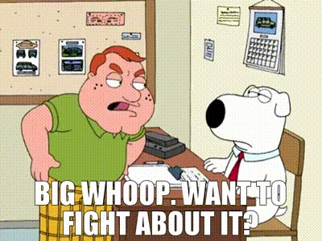

Let me be real with you - while 30% of patients generally find an SSRI efficacious, I've witnessed countless people struggle through nothing but disappointing if not flat-out failures of an experience with these medications.

As the love child of not one but two therapists, it should go without saying that I’m basically a certified LCSW in my own right…right?! Naturally it twas written in the stars that I’d fall in love with the field of Mental Health…and Psychology…and Neurochemistry. In other words, I’m not *completely* talking out of my ass!! I've devoured countless research papers over the years - we're talking around 100 in the last year alone.

Y’anyways, why the fuck is the cringe titular what it is? Well you see, I’m a bit of a nutcase myself. - I'm intimately familiar with the dark side of mental health. Depression and I are old friends. I’ve run the full gauntlet of SSRIs and can say without a doubt, the best experience I had was feeling comfortably numb. 

Then there was that 1 time I went hard-in-the-paint in analyzing my own neurobiology along with my previous drug interactions. I concluded Lamictal (Lamotrigine) and Abilify (Aripiprazole) was my golden ticket. These are both metaphorically and literally atypical. We're talking real outsider medications here - an anti-seizure drug moonlighting as an antidepressant, paired with what was then a revolutionary atypical antipsychotic. So what happened? I happened. Whoops! I thought I was okay enough and I was pursuing a career in which I couldn’t be a sad sack of shit. Spoiler Alert: I was dead wrong. 

On paper, I was crushing it – grinding through 8-hour workdays, logging flight hours, creating music, the whole nine yards. But underneath? That's another story. Then COVID hit, and everything went full-on FUBAR. The next six months? Pure chaos. Naturally what I’d been on just hadn’t been enough in my mind, so my PDoc and I explored other avenues. The next few years were a pharmaceutical merry-go-round - Fluoxetine, Duloxetine, Wellbutrin – all fell short. Then came the plot twist: my therapist-for-a-Mommy connected me with a colleague who opened my eyes to psychiatry's rebellious underbelly – I felt at home.

Now, I may be putting my own spin on this, but so what? S U E me!   
Here's the real kicker: we've gone down the rabbit hole of over-categorizing mental health, creating endless subcategories of subcategories until we can't see the forest for the trees. Instead of addressing the core issue - mood disorders - we're obsessing over hyper-specific conditions, niche enough only exist in the DSM-69. And guess what happens when you get lost in the diagnostic weeds? You completely miss the plot. Here's the real truth bomb: the issue isn’t so much that you are too blue or too anxious or whatever you might be, it is the dysregulation of emotions. Maybe you feel sad when you should feel angry. Maybe you feel angry when you should feel happy. The reality? You're not just 'too much' of any one thing - your emotional dial is just stuck on certain frequencies more often than others. Modern Psychiatry often misses the big picture. After all, are the problems and gut-wrenching details of your life you pour out in therapy not a big deal? Mmm, most likely these aren’t your own personal shortcomings – we just live in this post-industrial cesspool that propagate these problems. You don’t need to change as much as our society, our “culture” (or lack thereof) needs to. Instead, you just need to learn to live with ‘em; more-often-than-not we all must just cope with our issues.

Lamenting had become my default and I was all but ready to acquiesce in my comfortably numb place. Fast forward one year on Lithium and I’ve basically gotten my life back on track. O had to crawl, walk and learn how to run again. My most notable side effect, (plot twist: thanks Vraylar….whoops)? I’ve become a human sprinkler system. Any damn show I watch, whether it be the triumphant moments of *The Curious Case of Natalia Grace* or the saddest moments of *American Primeval* I’ve found myself absolutely bawling on a whim. But otherwise, I feel even-keeled, so of course I can take some cinematic cries. It’s better than your pecker not working or the anhedonia one normally experiences with/without SSRIs. 

Look, I won't pretend to have all the answers to our collective mental health crisis. How could I when our society seems perfectly engineered to create these modern “tragedies of the common.” We cannot go on like this and expect a different outcome. I will say that I don’t think we need a miracle; we just need to buy some time because we’re at a crossroads. With AI advancements, new forms of communities, and people finally realizing they need to get their shit together before helping others (goodbye abusers, alcoholics or otherwise unhinged peoples), there's hope. And hey, while we're waiting for the future to arrive, there's always that time-tested remedy: exercise. So get out there and exorcise those demons, you beautiful disasters.