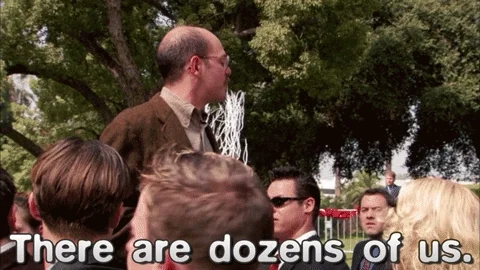

Let's dive into an esoteric field full of landmines: the complex relationship between humans and exotic animals. I’m sure for plenty of y’all, it’s not something you think of everyday – or maybe ever. However it is expansive and it is a pervasive issue. I catch myself flicking through my TimTom Feed, thumb tentatively hovering over the like button of Pumba the Caracal or Медьведь Светланы (that's Svetlana's Bear, for you plebeians) videos, fighting the cognitive dissonance between their undeniable cuteness and the ethical nightmare they represent. Let's cut through the Instagram filter: exotic animals aren't meant to be social media props - they're meant to be wild, untamed, and free from our desperate need for likes and shares. That’s the bottomline.   

Take Pumba - that contemptuous growl isn't just noise, it's a primal protest against domestication, a daily reminder that the shitty owner has crossed the line. The Bear who shall remain nameless?  This majestic creature…reduced to a living Instagram prop…cycles through endless photoshoots with weirdo ballerina whackos, wannabe influencers chasing clout or odd Russian couples yearning for that unique wedding shot to hang at their dacha. The irony of using a captive wild animal to symbolize freedom and romance is apparently lost on them. Svet claims the bear isn't sedated but I call shenanigi  (that’s plural for shenanigan, plebeian) - a declawed apex predator docilely posing with strangers? That's not natural; that's pharmaceutical compliance. If either isn’t a prop for digital validation, I’ll be damned, but you can’t tell me Pumba nor the Bear invigorate others’ decisions to purchase their very own clout machine. What kind of a Clout Machine Lifestyle is a life for a 2-ton hummer suffering from a lack of hot bear babe hummers, huh? You tell me!

Now, there’s plenty of philosophical schools of thought on this (*dozens I tell you, dozens*)
 
Where was I? At one extreme, we have the anti-pet purists, wielding their philosophical absolutism like a moral compass that only points toward total animal independence. Fortunately I ain’t one of those, no SJW-type preach-o-potamus platitudes to spit…*yet*. But there are people, beyond the PETA zealots, who believe dogs, cats and rats or whatever fits your hat don’t make the scratch. Personally, I love my dog and you can fuck off. Certainly there will be terrible situations, ones outside the purview of animal cruelty (e.g., dogs left to sleep and sit around all day, *maybe* getting a couple 5 minute strolls around the block), but I don’t think that should ruin it for the rest of us. It’s almost like…guns, hookers and drugs! Prohibition often causes more harm than good - a truth that makes us uncomfortable but demands acknowledgment.

Maybe its prudent to accept reality – that the human condition cannot be forbade and people will do the thing anyways. In such a case, we should simply have robust community support systems and regulatory government programs that curtail the worst offenders. Sometimes its okay to snitch, Karen. 

With the negative out of the way, we can move on to the real tea. TL;DR lettuce not commodify exotic animals and we’ve opened Pandora’s Box when it comes to dogs, cats, rabbits and so on. We dun ducked up already and they need us as much as we need them, yay! In a world without strong communities and belongingness, our furry friends are oft our lifelines – emotional anchors in a storm of technological alienation. Our best defense against modern damnation, also known as the 1 AM 1 Train Jump…I mean, between SWIM (*someone who I met…plebeian, this is getting old*) and suicide. 

I think a doggo would prefer a handful of hours of sleep and laying around, considering they naturally sleep 10 to 14 hours of the damn day, than having to play Frogger to find scraps of food. But maybe that’s just me. We just don’t need to get more critters in our crew, if you ask me. But there’s plenty of shitheads who will force a ‘Roo into captivity, heck, a tiger, just to flex on the ‘gram or to get their furry feathers fluffed and stuffed. Okay, admittedly the latter is a stretch, but that’s how we all should treat these furry fella fuckers like. 

This is where things *finally* get interesting. What about zoo aminals and other spectacles? There are ethical ones for the endangered animals with proper roaming fields for all the grazing any Tasmanian Devil could dream for. But globally speaking, that’s probably 1 to 10% of captive animals. We keep ‘em safe and they live a nominally regular life. It is kinda like how we keep that weird furry kid who lives in his Mum’s basement comfortable! Unfortunately that’s nothing like the lives of caged Tiger attractions in Thailand or the Elephant Rides in Thailand or or…sorry Thailand, I’ll stop there. Sedated and constantly masturbated, these majestic creatures are subject to a grotesque parody of existence that strips away every shred of their regal dignity. Now this wouldn’t seem all too tumultuous of a topic but I swear to God every year I see another shmuck do the mental gymnastics to convince themselves that it’s not *that* unethical. I may have been one of those shmucks, whoops. YOLO amirite? Truthfully, I felt damning regret that overwhelmed me the second I stepped into the Tiger Tourist Trap, it’s no way for a Tiger to live. I keep those pictures under lock-and-key, I can’t even look at ‘em, I just cringe. Just because it is there doesn’t mean it always will be – it ain’t natural. 

Each liked video, each shared photo of a captive wild animal, creates ripples in an ecosystem of exploitation. Yet simply condemning these practices without acknowledging their deep psychological appeal misses crucial nuance. We're drawn to these creatures because they represent something wild and authentic in a world that feels increasingly artificial. The tragedy lies in how this yearning for connection often leads to further disconnection from nature's true essence. Don’t make the same mistake as yours truly. The End.